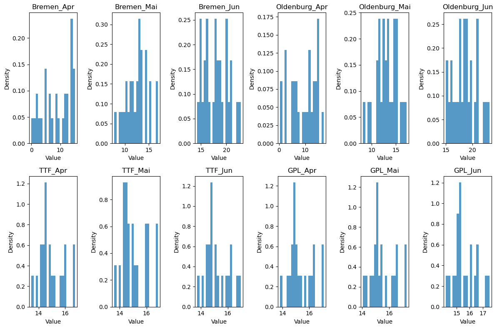
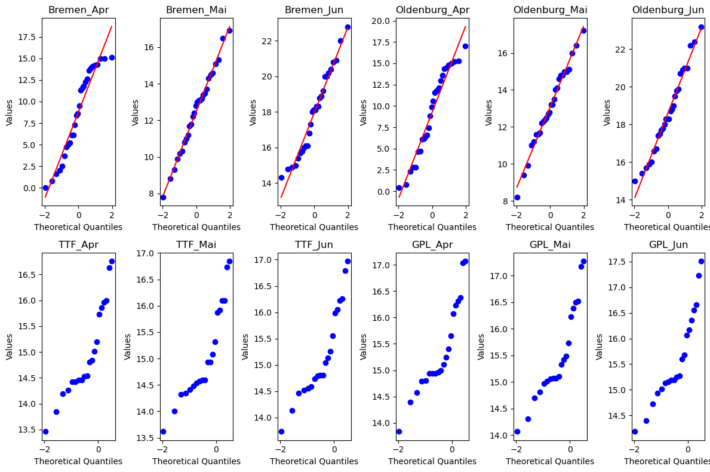

# Files
- `challenge.py`: main python file, simply run via IDE or via `python challenge.py` terminal command. It will generate delta-normal-VaR.
- `tests.py`: covered unittests for the `challenge.py` file. Run via same way. 
- `config.yaml`: added some VaR configs as well as initial prives etc. Use in `challenge.py`. 

# Explanation 
### Data Preparation:

- The script reads data from a CSV file and extracts temperatures and prices for relevant markets and cities (Bremen and Oldenburg).
- It calculates initial gas offtake volumes based on temperature expectations and pre-defined parameters.

### Forecasting and Delta Calculation:

- It retrieves forecasted temperatures and calculates the forecasted gas offtake volumes.
- The difference between forecasted and initial volumes is calculated as delta volumes.

### Portfolio Value Changes:

- It retrieves spot prices and calculates the changes in portfolio value based on delta volumes and spot price differences.

### Covariance Matrix and VaR Calculation:

- The script calculates the daily temperature changes for each city.
- It uses these daily changes to compute the covariance matrix, which captures the relationship between temperature changes in different cities.
- Finally, the calculate_VaR function takes the portfolio delta (combined delta volumes), covariance matrix, confidence level, and holding period to calculate the VaR.
- The VaR calculation uses the Normal Inverse Cumulative Distribution Function (ppf) from the scipy.stats.norm library to find the quantile corresponding to the confidence level. This quantile is then multiplied by the portfolio standard deviation and the square root of the holding period to get the VaR value.

# Discussion

1. Model for Risk Factors

    I recommend using the lognormal model for assessing risk factors in energy trading. Energy prices often exhibit skewed distributions with a right tail (see first plot 2nd row for prices), which makes them more suitable for lognormal distributions rather than normal distributions. 

    
    

2. Buying Volumes Up Front Using Average Temperatures

    Buying volumes based solely on average temperatures might not be optimal. Temperature is just one factor influencing demand and prices in energy markets. Other factors like wind power generation, competitor behavior, and unexpected events also play a role. A more comprehensive model considering these factors would be beneficial.

3. Delta-Normal VaR Suitability

    Delta-Normal VaR might be a reasonable first approach, but with limitations.It assumes normal distribution of returns, which might not be ideal for your data (see point 1). Delta-Normal VaR can underestimate risk for assets with fatter tails (more extreme events) like energy prices. Consider exploring alternative VaR methods like Monte Carlo simulation, which can handle non-normal distributions.

4. Risk-Free Measure and Trends

    In financial contexts, it serves as a benchmark for pricing risky assets and is essential for discounting future cash flows in valuation models. This knowledge is particularly important for managing cash flow uncertainties in long-term energy contracts. Monitoring market trends, including energy prices, temperature forecasts, and regulatory changes, is also critical. Environmental factors and increasing regulations on sustainability can significantly impact energy prices and trading strategies, requiring flexible risk management approaches.

5. Bonus: Hedging Strategy:

    - Options: Purchasing put options on relevant futures contracts (e.g., natural gas futures) to limit potential losses if prices rise sharply.
    - Financial Weather Derivatives: Weather derivatives specifically designed to hedge against temperature fluctuations.
    - Correlation-based Hedging: If there's a negative correlation between temperatures and another asset class (e.g., solar power generation), invest in that asset to offset potential losses in the Sigmoid portfolio.

References:

- https://www.investopedia.com/articles/04/092904.asp
- https://www.investopedia.com/terms/m/montecarlosimulation.asp
- https://www.investopedia.com/articles/investing/102014/lognormal-and-normal-distribution.asp
- Clewlow, M., & Strickland, C. (2008). Energy risk management in financial markets. John Wiley & Sons.
- Cont, R. (2006). Modeling liquidity in energy markets. Physica A: Statistical Mechanics and its Applications, 370(1-2), 1-22.
- Lucia, J. J., & Hodge, B. K. (2009). Strategic risk management in the energy sector. John Wiley & Sons.
- McNeil, A. J., Frey, R., & Embrechts, P. (2015). Quantitative risk management: Concepts, techniques and tools. Princeton University Press.
- Glasserman, P. (2004). Monte Carlo methods in financial engineering. Springer Science & Business Media.
- Hull, J. C. (2018). Options, futures, and other derivatives. Pearson Education Limited.
- Feinstein, Z. (2015). Weather derivatives: The art and science of managing weather risk. John Wiley & Sons.
- Jorion, P. (2009). Value at risk (VaR). McGraw-Hill Education.